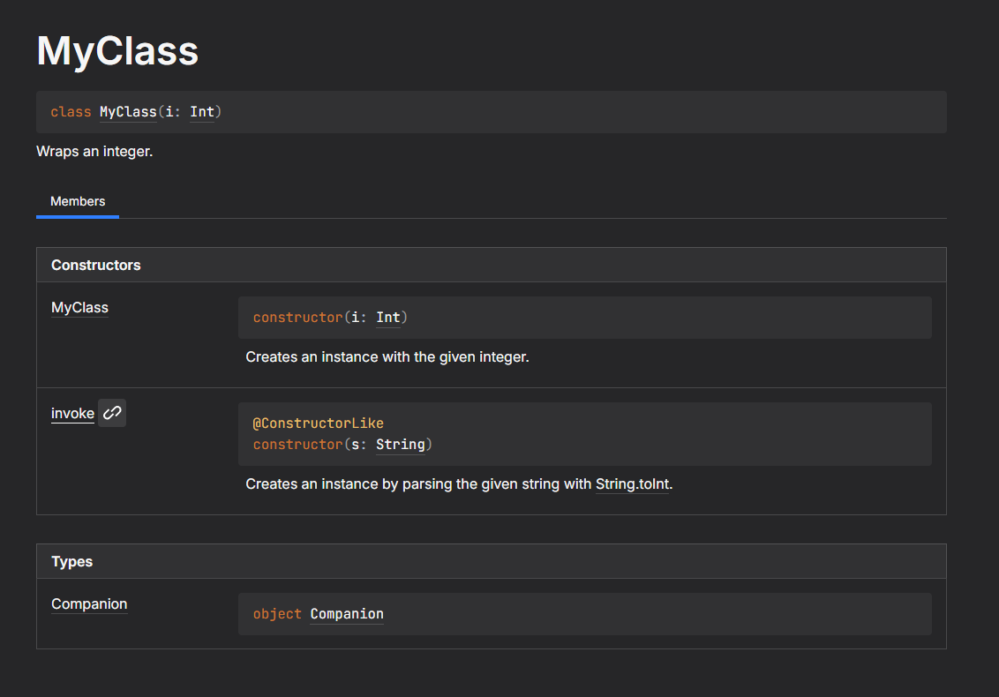

# ConstructorLike

Dokka plugin for documenting pseudo-constructors for Kotlin.

### Pseudo-constructors?

Most object-oriented languages have constructors that can be used to create an instance of a class.
But mostly, we need some preprocessing with the arguments: validating, transforming, etc.
Java introduced [flexible constructor bodies](https://openjdk.org/jeps/513) for this purpose,
but Kotlin cannot have such feature because we're stuck at this C-style constructor syntax:

```kotlin
constructor(s: String): this(s.toInt())
```

Or we might have an interface that can be instantiated by everyone, but giving a helper function would be great:

```kotlin
interface IntWrapper {
	val i: Int
}

fun wrap(i: Int): IntWrapper = object: IntWrapper {
	override val i: Int = i
}
```

And sometimes we need a generic constructor:

```kotlin
class Logger(val name: String)

inline fun <reified T> T.createLogger(): Logger = Logger(T::class.qualifiedName)
```

This leads us to using functions that look like constructors:
1. `operator fun invoke` functions in companion objects or an extension to one
2. Functions with the same name of the class ([`fun Char()`](https://kotlinlang.org/api/core/kotlin-stdlib/kotlin/-char.html))

These are what we call pseudo-constructors, since they don't look different with normal constructors: `MyClass(<parameters>)`

Unfortunately, these are not directly shown in the class documentation, since they are technically not constructors.
Users cannot notice such functions if they are not explicitly documented at each class,
and by the nature of people about writing documentations, this is a problem.

This plugin aids this by injecting such elements annotated with `@ConstructorLike` to the `Constructors` table of a class documentation:


Because they are *technically not constructors*, this is purely decorative:
navigating to such constructor leads to the actual definition of the pseudo-constructor,
which at the example above is an `operator fun invoke` in a companion object,
and the function's name is displayed at the first column of the `Constructor` table for when using it as a function reference(`::MyClass`).

### Specification details

To make a function as a pseudo-constructor, it must be annotated with `@ConstructorLike`.
Non-annotated elements will not be included.

The *target type* of the annotated function is its return type.
The target type must not be `kotlin.Unit`, `kotlin.Nothing`, an `annotation class`, `enum class`, or `object`,
and must be in the same module so that the plugin can inject the constructor to the documentation.
The annotated function must be placed in the same package as the target type.

Then, the function must also match one of the following:
it must be an `operator fun invoke`, or its name must match the target type's name.

For ease of parsing, we define a *helper* for the function to act as a constructor.
The helper is either the receiver of the function or the classlike owning the function;
but it can have no helper in case it is a package-level non-extension non-`invoke` function.

Finally, it is resolved based on the helper's kind:
- If the helper is a companion object, the target type must be a parent of the companion if it is an `operator fun invoke`,
  otherwise the target type must be a nested class of the parent of the helper.
- If the helper is a plain object, the function must not be an `operator fun invoke`,
  the target type must be a nested(`inner` or non-`inner`) class of the helper's class,
  and if the helper is not an object, the target type must also be an `inner` class.
- If the function has no helper, the target type must be a package-level class.

If the function violates anything from above, the plugin will raise a warning and will not include the function as a pseudo-constructor.

<details>
<summary>Examples</summary>

To be brief, function bodies are omitted.

```kotlin
class MyClass { // Also applies to abstract classes and interfaces
	companion object {
		// OK: used as `MyClass()`
		@ConstructorLike
		operator fun invoke(): MyClass

		// Bad: it is not marked `operator`
		@ConstructorLike
		fun invoke(): MyClass // Will not be presented afterward, but applies on all cases.

		// Bad: it is an extension
		@ConstructorLike
		operator fun Any.invoke(): MyClass

		// Bad: it does not return `MyClass`
		@ConstructorLike
		operator fun invoke(): Any // In practice, this will cause a 'target in different module' warning. 

		// OK: used as `MyClass.NestedClass()`
		@ConstructorLike
		fun NestedClass(): NestedClass

		// Bad: it is an extension
		@ConstructorLike
		fun Any.NestedClass(): NestedClass

		// Bad: it is not named `NestedClass`
		@ConstructorLike
		fun createNested(): NestedClass // Will not be presented afterward, but if the function is not an `operator fun invoke`, its name must match its target type.

		// Bad: it does not return `NestedClass`
		@ConstructorLike
		fun NestedClass(): Any // Will not be presented afterward, same reason as above.

		// Bad: target type is `InnerClass`
		@ConstructorLike
		fun InnerClass(): InnerClass // You cannot create inner classes with a companion object in any way.
	}
	
	class NestedClass

	inner class InnerClass
	
	// Bad: target type is `NestedClass`
	@ConstructorLike
	fun NestedClass(): NestedClass // You cannot create nested classes with the outer class in any way, except using companion objects.

	// OK: used as `myClassInstance.InnerClass()`
	@ConstructorLike
	fun InnerClass(): InnerClass

	// Bad: it is an extension
	@ConstructorLike
	fun Any.InnerClass(): InnerClass

	// Bad: it does not return `InnerClass`
	@ConstructorLike
	fun InnerClass(): Any

	// Bad: it is an `operator fun invoke`
	@ConstructorLike
	operator fun invoke(): InnerClass
}

// OK: used as `MyClass()`
@ConstructorLike
operator fun MyClass.Companion.invoke(): MyClass

// Bad: it is not an extension function on `MyClass.Companion`
@ConstructorLike
operator fun MyClass.invoke(): MyClass

// Bad: it does not return `MyClass`
@ConstructorLike
operator fun MyClass.Companion.invoke(): Any

// OK: used as `MyClass()`
@ConstructorLike
fun MyClass(): MyClass

// Bad: it is an extension
@ConstructorLike
fun Any.MyClass(): MyClass

// OK: used as `MyClass.NestedClass()`
@ConstructorLike
fun MyClass.Companion.NestedClass(): NestedClass

// Bad: it is not an extension on `MyClass.Companion`
@ConstructorLike
fun MyClass.NestedClass(): NestedClass

// OK: used as `myClassInstance.InnerClass()`
@ConstructorLike
fun MyClass.InnerClass(): InnerClass

// Bad: it is not an extension on `MyClass`
@ConstructorLike
fun MyClass.Companion.InnerClass(): InnerClass
```

</details>

In case of `expect`/`actual` declarations, only the `expect` matters since `actual` declarations must match the signature of `expect`:
but make sure to annotate `actual` declarations with `@ConstructorLike`, otherwise the behavior of the plugin is undefined.

# License

This project's source code is *mainly* licensed with [MPL 2.0](LICENSE).
Note that some files have different licenses other than MPL:
currently, only [DefaultPageCreatorFunctions.kt](dokka-plugin/src/main/kotlin/DefaultPageCreatorFunctions.kt)
is licensed with [Apache 2.0](third-party-licenses/Kotlin/dokka/LICENSE.txt).

For more third-party license information, see [third-party-licenses/](third-party-licenses).
